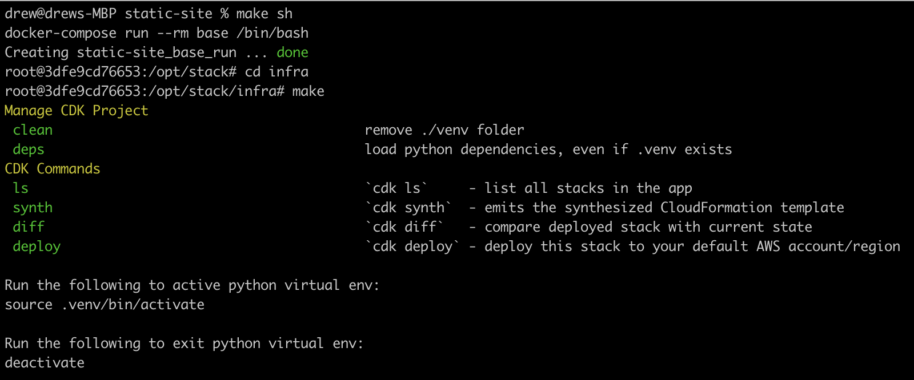

This is a Python project for infrastructure management with with CDK.

The `cdk.json` file tells the CDK Toolkit how to execute your app.

The key file with infrastructure code is `foo/foo_stack.py`.

## Useful CDK commands

 * `cdk ls`          list all stacks in the app
 * `cdk synth`       emits the synthesized CloudFormation template
 * `cdk deploy`      deploy this stack to your default AWS account/region
 * `cdk diff`        compare deployed stack with current state
 * `cdk docs`        open CDK documentation

# How to operate

Common operations can take place from your workstation, at the root of this repo, by running `make`.


## Using the development container

If you need to run specific commands that aren't available as make targets, you can create a containerized shell with everything you need for CDK development and more. To create a new shell run `make sh`

Once the container starts up you'll have a `/bin/bash` shell where you can run any commands you'd expect in a linux terminal.

Here's all you need to do to run a `cdk` command from the `infra/` folder:

```
make sh

cd infra
source .venv/bin/activate
cdk ls
```

Here's what it looks like on a workstation:


`make` is also available within the `infra/` folder with the same commands as the project root, incase you need it from within your development container.



## Python dependency management
A .venv will be created automatically the first time you run any CDK command.

Once .venv exists, this project will not try to install any new dependencies. This should save execution time, but won't automatically run again if you change any dependencies.

To add additional dependencies, for example other CDK libraries, just add
them to your `setup.py` file and run the `make deps` command.

You can run `make clean` then `make deps` to ensure a clean download of dependencies.